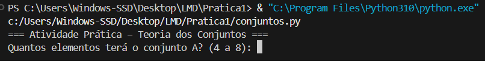
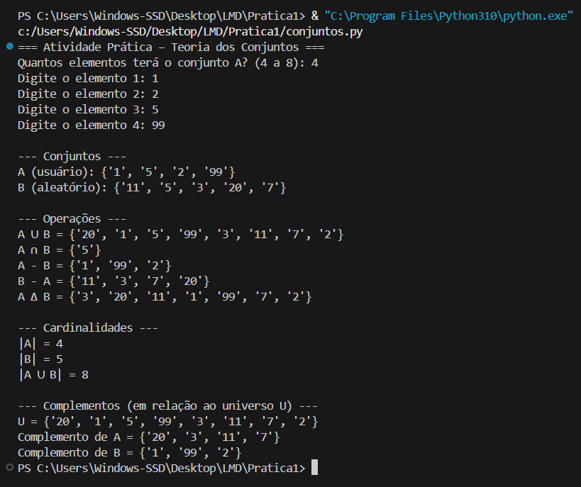

<p align="center">
  
</p>

<p align="center">
  <strong>Universidade Federal do Maranhão</strong><br>
  <strong>Centro de Ciências Exatas e Tecnologias</strong><br>
  <strong>Curso de Engenharia da Computação</strong><br>
  <strong>Disciplina: Lógica e Matemática Discreta</strong><br>
  <strong>Professor: Rondineli Seba</strong><br><br>
  <strong>Discentes:</strong><br>
  <strong>Renata Costa Rocha</strong> — Matrícula: 20240001556<br>
  <strong>Raphael Câmara Sá</strong> — Matrícula: 20240001547
</p>

<hr>

<p align="center">
  <em>
    Este projeto foi desenvolvido como parte das atividades da disciplina de 
    <strong>Lógica e Matemática Discreta</strong>, do curso de Engenharia da Computação 
    da Universidade Federal do Maranhão.
    <br><br>
    O projeto tem como finalidade aplicar os conceitos fundamentais da 
    <strong>Teoria dos Conjuntos</strong> por meio do desenvolvimento de um programa 
    computacional, reforçando a relação entre fundamentos matemáticos e sua aplicação 
    prática em programação.
    <br><br>
    O desenvolvimento do código, aliado à documentação técnica apresentada neste 
    repositório, corresponde às atividades avaliativas da <strong>Nota 1</strong> 
    da disciplina.
  </em>
</p>

---

<p align="center">
  
  
  
</p>

---

## 1. Descrição do Projeto

Este repositório contém a implementação da **Prática 1** da disciplina de Lógica e Matemática Discreta.

A proposta do trabalho consistiu na elaboração de um programa computacional com o objetivo de aplicar, de forma prática, os principais conceitos da **Teoria dos Conjuntos**, tais como união, interseção, diferença, complemento e cardinalidade, utilizando a linguagem Python.

O programa foi desenvolvido em **Python**, utilizando os recursos nativos da linguagem, especialmente a estrutura `set`, adequada para a representação e manipulação de conjuntos.

---

## 2. Objetivo

O principal objetivo deste trabalho é:

- Aplicar os conceitos de união, interseção, diferença, complemento e cardinalidade de conjuntos;
- Desenvolver um código organizado, legível e modular;
- Utilizar boas práticas de programação;
- Produzir documentação clara e coerente com os conceitos estudados em sala.

---

## 3. Especificação do Problema

O programa trabalha com dois conjuntos distintos:

- **Conjunto A**: definido pelo usuário, contendo entre 4 e 8 elementos;
- **Conjunto B**: gerado aleatoriamente pelo programa, também contendo entre 4 e 8 elementos.

A partir desses conjuntos, são realizadas as seguintes operações:

- União (A ∪ B);
- Interseção (A ∩ B);
- Diferença (A − B e B − A);
- Diferença simétrica (A Δ B);
- Cardinalidade dos conjuntos;
- Complemento de A e de B em relação a um universo definido.

---

## 4. Tipo de Dados Utilizado

Os elementos dos conjuntos foram definidos como **strings**, permitindo flexibilidade na entrada dos dados e facilitando a visualização dos resultados no terminal.  
A escolha do tipo de dado está alinhada aos objetivos didáticos da atividade.

---

## 5. Organização do Código

O código foi estruturado de forma modular, utilizando funções para:

- Leitura e validação do conjunto definido pelo usuário;
- Geração do conjunto aleatório;
- Execução das operações de conjuntos;
- Exibição organizada dos resultados.

Essa organização contribui para a legibilidade, manutenção e reutilização do código.

---

## 6. Como Executar o Programa

### Pré-requisitos
- Python 3.x instalado
- Terminal de comandos (CMD, PowerShell ou terminal do VS Code)

### Execução

1. Clone o repositório:
```bash
git clone https://github.com/ahcorataner/conjuntos-pratica1.git
````

2. Acesse o diretório do projeto:

```bash
cd conjuntos-pratica1
```

3. Execute o programa:

```bash
python conjuntos.py
```

---

## 7. Exemplos de Execução

### Definição dos Conjuntos

<p align="center">
  
</p>

### Resultados das Operações

<p align="center">
  
</p>

---

## 8. Relação com a Teoria dos Conjuntos

Cada operação implementada no código corresponde diretamente a um conceito formal da Teoria dos Conjuntos estudado em sala de aula.
A utilização da estrutura `set` da linguagem Python permitiu uma implementação fiel e eficiente das operações matemáticas propostas.

---

## 9. Considerações Finais

O desenvolvimento desta prática possibilitou consolidar os conceitos teóricos da disciplina por meio de uma aplicação computacional, reforçando a importância da integração entre matemática e programação na formação em Engenharia da Computação.

---

## 10. Licença

Este projeto possui finalidade **exclusivamente acadêmica**, sendo desenvolvido para fins educacionais no contexto da disciplina de Lógica e Matemática Discreta da UFMA.

---

## 11. Contato

Para dúvidas, sugestões ou solicitações relacionadas a este projeto:

* **Renata Costa Rocha** — [renata.rocha@discente.ufma.br](mailto:renata.rocha@discente.ufma.br)
* **Raphael Câmara Sá** — [raphael.sa@discente.ufma.br](mailto:raphael.sa@discente.ufma.br)
---


